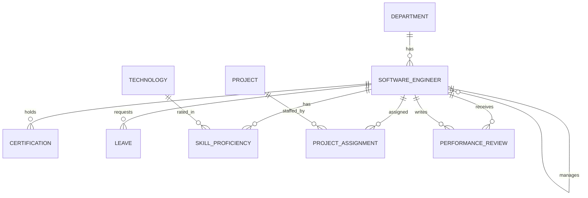

# DevSphere – Software Engineer & Project Management System

A RESTful backend built with **Java 21, Spring Boot and PostgreSQL** to manage software engineers and everything around them: departments, projects, assignments, technology skills, leaves, certifications and performance reviews.

The project follows a layered architecture (Controller → Service → Repository) with DTOs, entity mappers, request validation and centralized exception handling.

---

## Features

- **Engineer management:** full CRUD for software engineers with department, manager and subordinate (self-referencing) relationships.
- **Projects and assignments:** create projects, assign engineers with an allocation percentage and date range.
- **Allocation rules:** an engineer cannot be assigned twice to the same project in overlapping periods, and total allocation across overlapping assignments cannot exceed 100%.
- **Leave workflow:** leaves move through `PENDING → APPROVED / REJECTED`. Only pending leaves can be edited, approved or rejected, and overlapping pending/approved leaves for the same engineer are blocked.
- **Availability check:** `GET /api/v1/software-engineers/{id}/availability` combines approved leave and project allocation to report an engineer's available capacity on a given date.
- **Skills and technologies:** track each engineer's proficiency (`BEGINNER`, `INTERMEDIATE`, `ADVANCED`, `EXPERT`) per technology.
- **Certifications and performance reviews:** per-engineer records, with reviewer linked to another engineer.
- **Pagination, filtering and search:** pageable list endpoints (default page size 20, sorted by id) and dynamic search built with JPA Specifications.
- **Validation:** request DTOs validated with Jakarta Bean Validation (`@NotNull`, `@NotBlank`, `@Email`, `@Positive`, `@Past`, `@Pattern`, etc.).
- **Centralized error handling:** a global exception handler maps errors to consistent HTTP status codes (see [Error handling](#error-handling)).
- **Local database via Docker Compose** (PostgreSQL).

---

## Tech Stack

| Area | Technology |
|---|---|
| Language | Java 21 |
| Framework | Spring Boot 4.1.1 (Spring Web MVC) |
| Persistence | Spring Data JPA, Hibernate |
| Database | PostgreSQL |
| Validation | Jakarta Bean Validation (`spring-boot-starter-validation`) |
| Build | Maven (Maven Wrapper included) |
| Local DB | Docker Compose |

---

## Architecture

```
src/main/java/com/demo/demo1
├── controller/     # REST controllers (one per resource)
├── service/        # Business logic and rules
├── repository/     # Spring Data JPA repositories
│   └── spec/       # JPA Specifications for dynamic search
├── entity/         # JPA entities and enums
├── dto/            # Create / Update (PUT, PATCH) / Response DTOs
├── mapper/         # Entity <-> DTO mappers
└── exception/      # Custom exceptions and GlobalExceptionHandling
```

### Data model



**Enums:** `LeaveStatus` (PENDING, APPROVED, REJECTED), `ProjectStatus` (PLANNED, ACTIVE, ON_HOLD, COMPLETED, CANCELLED), `ProficiencyLevel` (BEGINNER, INTERMEDIATE, ADVANCED, EXPERT).

---

## Getting Started

### Prerequisites

- JDK 21
- Docker and Docker Compose (for the local PostgreSQL database)
- Git

### 1. Clone the repository

```bash
git clone https://github.com/<your-username>/DevSphere-Software-Engineer-Project-Management-System.git
cd DevSphere-Software-Engineer-Project-Management-System
```

### 2. Start PostgreSQL

```bash
docker compose up -d
```

This starts a PostgreSQL container with database `demo1`, exposed on **port 5332** on your machine. These credentials are for **local development only**.

### 3. Create a `.env` file

Create a `.env` file in the project root (it is listed in `.gitignore`, so it won't be committed):

```properties
DB_URL=jdbc:postgresql://localhost:5332/demo1
DB_USERNAME=software-engineer-demo1
DB_PASSWORD=1234
```

Use the same values as in `docker-compose.yml`. If you change the compose credentials, change them here too.

### 4. Run the application

```bash
# Linux / macOS
./mvnw spring-boot:run

# Windows
mvnw.cmd spring-boot:run
```

The API starts on **http://localhost:9090**.

> **Note:** `spring.jpa.hibernate.ddl-auto` is set to `create-drop`, so tables are recreated and **all data is wiped on every restart**. Change it to `update` (or add a migration tool) if you want data to persist.

### Build a jar

```bash
./mvnw clean package
java -jar target/demo1-0.0.1-SNAPSHOT.jar
```

---

## API Overview

Base URL: `http://localhost:9090/api/v1`

All list endpoints are pageable: `?page=0&size=20&sort=id,asc`.

| Resource | Base path | Key operations |
|---|---|---|
| Software engineers | `/software-engineers` | CRUD (PUT and PATCH), by email, first name, department, manager, designation, `/search`, `/{id}/availability` |
| Departments | `/departments` | CRUD (PATCH), lookup by `deptCode` |
| Projects | `/projects` | CRUD (PATCH), by status, by date range (`/dates`), `/search` |
| Project assignments | `/project-assignments` | CRUD (PUT and PATCH), by engineer |
| Technologies | `/technologies` | CRUD (PUT and PATCH) |
| Skills | `/skills` | CRUD (PUT and PATCH), by engineer |
| Leaves | `/leaves` | CRUD (PUT and PATCH), by engineer, by status, `/{id}/approve`, `/{id}/reject` |
| Certifications | `/certifications` | CRUD (PATCH), by engineer |
| Performance reviews | `/performance-reviews` | CRUD (PATCH), by engineer, by reviewer |

Create endpoints use `POST /insert`. In total the API exposes roughly 70 endpoints across 9 resources.

### Search and filter parameters

**Engineers** – `GET /software-engineers/search`

| Parameter | Type | Description |
|---|---|---|
| `name` | string | Match on name |
| `email` | string | Match on email |
| `departmentId` | integer | Filter by department |
| `employmentStatus` | string | Filter by employment status |
| `technologyId` | integer | Engineers with a given technology |
| `projectId` | integer | Engineers on a given project |
| `availableOnly` | boolean | Only available engineers |
| `availableOn` | date (`yyyy-MM-dd`) | Availability date |

**Projects** – `GET /projects/search`: `query`, `status`, `engineerId`
**Projects by dates** – `GET /projects/dates?start=yyyy-MM-dd&end=yyyy-MM-dd`

### Example requests

```bash
# Page through engineers
curl "http://localhost:9090/api/v1/software-engineers/?page=0&size=10"

# Search engineers in a department who are available on a date
curl "http://localhost:9090/api/v1/software-engineers/search?departmentId=1&availableOnly=true&availableOn=2026-11-01"

# Check an engineer's capacity on a date
curl "http://localhost:9090/api/v1/software-engineers/1/availability?date=2026-11-01"

# Approve a pending leave
curl -X POST "http://localhost:9090/api/v1/leaves/1/approve"
```

---

## Business Rules

- **Leaves:** a leave's start date cannot be after its end date. Only `PENDING` leaves can be edited, approved or rejected. A new or updated leave cannot overlap an existing `PENDING` or `APPROVED` leave for the same engineer (`REJECTED` leaves are ignored).
- **Assignments:** an engineer cannot be assigned to the same project in an overlapping period, and total allocation across overlapping assignments cannot exceed 100%.
- **Engineers:** `employeeId` is unique.

## Error handling

Errors are handled centrally in `GlobalExceptionHandling`:

| Status | When |
|---|---|
| `400 Bad Request` | Bean validation fails (field-wise error map) or invalid arguments (e.g. start date after end date, allocation above 100%) |
| `404 Not Found` | Engineer, department, project, technology, skill, certification, leave, review or assignment not found |
| `409 Conflict` | Leave or assignment conflicts, data integrity violations (e.g. duplicate unique value) |
| `500 Internal Server Error` | Unexpected runtime errors |

---

## Configuration

| Property | Value |
|---|---|
| `server.port` | `9090` |
| `spring.datasource.*` | Read from `DB_URL`, `DB_USERNAME`, `DB_PASSWORD` in `.env` |
| `spring.jpa.hibernate.ddl-auto` | `create-drop` |
| `spring.jpa.show-sql` | `true` |

Never commit real credentials. `.env` is already in `.gitignore`.

---

## Roadmap

- [ ] Authentication and role-based access with Spring Security and JWT
- [ ] Unit and integration tests for services and controllers
- [ ] API documentation with Swagger / OpenAPI
- [ ] Database migrations with Flyway
- [ ] Dockerfile for the application itself
- [ ] CI pipeline (build and test on every push)

---

## Author

**Deepa Pandey**
[LinkedIn](https://www.linkedin.com/in/deepa-pandey-74a5b733b) · [GitHub](https://github.com/Deepa-Pandey6030) · [LeetCode](https://leetcode.com/u/deepa_peace/)